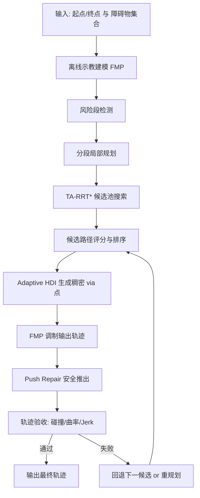

# 本周对底层算法结构进行了拆分和重构

由于机械臂仿真一直没跑通，下周准备先移植到移动机器人上先，尽快得到demo**和Gazebo 对比数据**。后续在现有框架下加一个适配器调用IK进行移植。

# 算法部分初稿如下

## 1. 问题定义
给定笛卡尔起点与终点

$$
\mathbf{p}_s,\mathbf{p}_g\in\mathbb{R}^d,\ d\in\{2,3\}
$$

以及障碍集合 $\mathcal{O}=\{o_k\}_{k=1}^{M}$，目标是在保留示教意图的前提下生成无碰撞、平滑、可执行轨迹 $\mathbf{p}(t)$。

有符号距离定义为

$$
d(\mathbf{p},\mathcal{O})=\min_{o_k\in\mathcal{O}} d(\mathbf{p},o_k),
$$

其中 $d<0$ 表示点位于障碍内部。

---

## 2. 方法总览
本文提出 TA-HDI-FMP 流程：
1. 离线示教建模（FMP）
2. 风险段检测与截断候选搜索（TA-RRT*）
3. 自适应高密度插值（Adaptive HDI）
4. 代数调制（FMP Modulation）
5. 轨迹安全修复（Push Repair）
6. 验收判定（Collision / Curvature / Jerk）

---

## 3. 示教意图建模（FMP）
对时空特征 $\mathbf{z}_t$ 建立模糊规则库。第 $i$ 条规则的马氏距离为

$$
D_i(\mathbf{z}_t)=(\mathbf{z}_t-\mathbf{c}_i)^\top\mathbf{\Sigma}_i^{-1}(\mathbf{z}_t-\mathbf{c}_i).
$$

输出由加权局部回归构成：

$$
\hat{y}(t)=\sum_{i=1}^{N_c} h_i(\mathbf{z}_t)\,\phi(\mathbf{z}_t)^\top\boldsymbol{\theta}_i,
$$

其中 $h_i$ 为归一化隶属权重。

---

## 4. 截断候选搜索（TA-RRT*）
先在示教轨迹上检测风险索引：

$$
\mathcal{I}_d=\{j\mid d(\mathbf{p}^{demo}_j,\mathcal{O})<\delta_{safe}\}.
$$

对每个风险段构建局部起终点，执行 Informed RRT*，在时间预算 $B$ 内返回候选池 $\mathcal{P}=\{\pi_k\}$。

Informed 采样采用椭球变换：

$$
\mathbf{x}=\mathbf{C}\mathbf{L}\mathbf{u}+\mathbf{x}_{center},\quad \|\mathbf{u}\|\le 1.
$$

---

## 5. 候选路径评分
对候选路径 $\pi$ 定义四项代价：

$$
J_{len}=\frac{L(\pi)}{\|\pi_1-\pi_{end}\|+\epsilon},
$$

$$
J_{curv}=\mathrm{P99}(\kappa(\pi)),
$$

$$
J_{risk}=\frac{0.7}{\min d(\pi)+\epsilon}+\frac{0.3}{\mathrm{mean}\,d(\pi)+\epsilon},
$$

$$
J_{dev}=\frac{1}{N}\sum_{n=1}^{N}\|\pi_n-\pi_n^{demo}\|.
$$

归一化后线性组合：

$$
\tilde{J}_i=\frac{J_i}{J_i+1},\quad
J=\sum_{i=1}^{4} w_i\tilde{J}_i.
$$

按 $J$ 升序选取候选。

---

## 6. 自适应 HDI
对每个路径段根据风险与曲率自适应设定插值步长：

$$
\Delta s=\mathrm{clip}\left(\frac{\Delta s_0}{1+k_r\rho+k_\kappa\bar{\kappa}},\Delta s_{min},\Delta s_{max}\right),
$$

$$
\rho=\frac{r}{1+r},\quad r=\frac{1}{d_{mid}+0.1}.
$$

生成稠密 via 点及对应时间戳 $(t_q,\mathbf{v}_q)$。

---

## 7. FMP 调制与后处理修复
FMP 调制可写为

$$
\hat{\mathbf{p}}(t)=\mathcal{M}\big(\mathbf{p}_{demo}(t),\mathcal{V}\big),
$$

其中 $\mathcal{V}$ 为 via 约束集合。

为抑制 via 间隔区回拉造成的局部穿障，加入框架层后处理。若 $d_i<d_{tar}$，则

$$
\mathbf{p}_i\leftarrow \mathbf{p}_i+(d_{tar}-d_i+\eta)\,\mathbf{g}_i,
$$

其中 $\mathbf{g}_i$ 为有符号距离的外法向方向。随后进行高斯平滑并固定端点。

---

## 8. 验收判定

### 8.1 碰撞与清距

$$
d_{min}=\min_i d(\mathbf{p}_i,\mathcal{O}).
$$

无穿障判定：

$$
\mathrm{pass}_{np}: d_{min}>-10^{-6}.
$$

清距判定：

$$
\mathrm{pass}_{clr}: d_{min}>d_{clr}.
$$

### 8.2 曲率（弧长重采样后）
先对轨迹做弧长均匀重采样，再计算离散曲率：

$$
\kappa_n=\frac{2|\mathbf{v}_1\times\mathbf{v}_2|}{\|\mathbf{v}_1\|\,\|\mathbf{v}_2\|\,\|\mathbf{v}_1+\mathbf{v}_2\|+\epsilon}.
$$

取 $\mathrm{P99}(\kappa)$ 作为曲率指标。

### 8.3 Jerk

$$
\mathbf{a}_n=\tilde{\mathbf{p}}_{n+1}-2\tilde{\mathbf{p}}_n+\tilde{\mathbf{p}}_{n-1},\quad
\mathbf{j}_n=\mathbf{a}_{n+1}-\mathbf{a}_n,
$$

$$
\mathrm{jerk}_{rms}=\sqrt{\frac{1}{N_j}\sum_n\|\mathbf{j}_n\|^2}.
$$

最终通过条件：

$$
\mathrm{pass}=\mathrm{pass}_{np}\land\mathrm{pass}_{clr}\land(\kappa_{P99}<\kappa_{th})\land(\mathrm{jerk}_{rms}<j_{th}).
$$

---

## 9. 复杂度简述
1. 局部搜索主耗时来自 TA-RRT*，近似为 $\mathcal{O}(N_{iter}\cdot C_{col})$。
2. HDI 与调制阶段主要受 via 点数影响，近似线性于 $|\mathcal{V}|$。
3. 后处理推离与验收为轨迹点线性复杂度。

---

## 10. 复现实验建议
1. 固定随机种子（如 1001~1030）导出基线 CSV。
2. 报告指标：success、min_dist、kappa_P99、jerk_rms、path_length。
3. 对二值 success 使用 Fisher/McNemar；对连续指标使用 Wilcoxon。

---

## 11. 算法流程图

